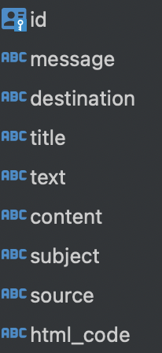
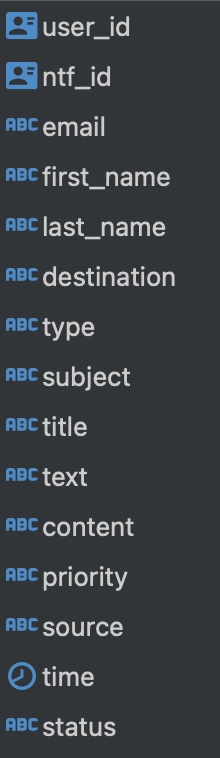
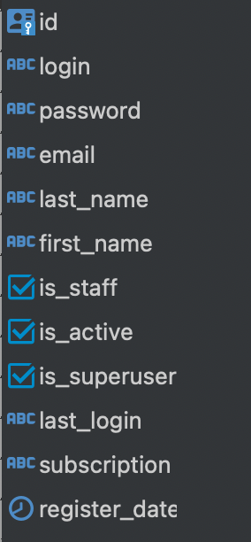

# Сервис нотификаций

## Запуск
`docker-compose -f docker-compose-app.yml up`
#### Шедулер: `python schedule/scheduler.py`
#### Консьюмер: `src/worker/worker.py`

OpenAPI: `http://0.0.0.0:8012/api/openapi`

## Струткура
### Источники уведомлений
1. Панель администратора
2. Генератор автоматических событий
3. API для приема уведомлений

### Используемые таблицы в Postgres
1. email_template

2. notice

3. user_ntf

4. user

